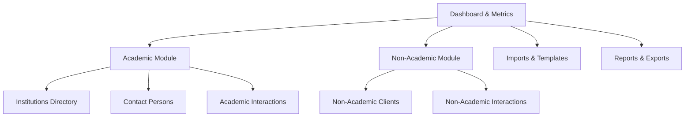

# College CRM & Institution Management System (CIMS) - Technical & Functional Documentation

This document provides a comprehensive overview of the technical architecture, database design, core features, and configuration guidelines for the College CRM & Institution Management System (CIMS).

---

## 1. Project Overview
The College CRM is a multi-tenant corporate relationship and academic directory management web application. It allows administrators and staff to organize educational institutions (universities, colleges), academic contacts, non-academic corporate clients, and log multi-channel communications (interactions) for placement, collaboration, and marketing purposes.

---

## 2. Technical Stack
- **Backend Framework**: Laravel 11.x (PHP 8.2+)
- **Database**: MySQL / MariaDB
- **Frontend Architecture**: 
  - Blade Templates (HTML5 + CSS3 + Bootstrap 5.3)
  - JavaScript (ES6, Alpine.js, jQuery, Chart.js)
  - DataTables / Yajra Datatables (for server-side AJAX table rendering)
- **Import/Export Engine**: Laravel-Excel (`maatwebsite/excel`) & `dompdf`
- **Testing Suite**: PHPUnit (Laravel Feature/Unit Testing)

---

## 3. Core Modules & Features



### A. Authentication & RBAC (Role-Based Access Control)
- **Multi-Level User Management**: Support for `Admin` and `Employee` roles.
- **Custom Status Controls**: Users must have an `active` status flag to bypass the global `RoleMiddleware` check. Inactive user access is denied instantly.
- **Permissions Master**: Fine-grained permissions mapping to individual CRUD routes (e.g., `contacts.create`, `non-academic-interactions.view`).

### B. Academic Directory (Institutions, Contacts & Interactions)
- **Institutions Database**: Manage universities and colleges.
  - Fields tracked: Name, State, Type (Autonomous, Affiliated), Affiliated University.
  - Automated association: Specifying an affiliated university dynamically matches it or generates a new university master option.
- **Contact Directory**: Manage details of decision-makers.
  - Fields tracked: Associated College, Full Name, Designation, Department, Phone, and Email.
- **Interactions Center**: Log and coordinate touchpoints.
  - Tracks: Handled by Employee, Contact Date, Mode of Communication (Phone Call, Email, Visit), Current Status (Interested, Callback, Closed), Purpose, and Client Response.
  - Features an AJAX selector to dynamically retrieve contact persons based on the selected college.

### C. Non-Academic Corporate Module
Designed to manage relations with corporate partners and corporate placements:
- **Non-Academic Clients**:
  - Details: Client Company Name, Website, Email ID, Phone, Address, Contact Person details, Industry category.
- **Non-Academic Interactions (Timeline)**:
  - Supports logging multiple follow-up interactions (handshake/call/visit) over time.
  - Renders a visually interactive, clean vertical timeline on the Client Profile details screen.

### D. Data Import Center (Bulk Operations)
To expedite migration, the CRM supports three distinct Excel/CSV import sheets:
1. **Unified Sheet (Single-Upload)**:
   - Header schema: `college_name`, `state`, `type`, `affiliated_university`, `contact_name`, `designation`, `department`, `mobile`, `email`.
   - Engine: Automatically processes rows, creates/resolves institutions first (with exact-match validation), and inserts/updates associated contact persons under that record.
2. **Institutions-Only Sheet**: Uploads and validates college/university configurations.
3. **Contacts-Only Sheet**: Connects bulk contacts list with existing database institutions.
- **Error Logging**: In the event of validation mismatches, failures are parsed and presented in a clean UI table specifying the exact sheet row, target attribute, failure description, and wrong value.

### E. Custom Reports & Analytics
- **Dashboard Overview**: Integrates dynamic metric widgets, recent registrations, and interactive Chart.js doughnut graphics displaying interaction coverage.
- **Filter Suite**: Allows filtering report outputs by **State** and **University**.
- **Multi-Format Exports**: One-click exports of filtered lists to **Excel**, **CSV**, or formatted **PDF** layouts.

---

## 4. Database Schema Reference

### `colleges`
| Column | Type | Nullable | Key / Description |
| :--- | :--- | :---: | :--- |
| `id` | bigint | No | Primary Key |
| `name` | varchar | No | Institution Name |
| `state` | varchar | No | State (Mandatory drop-down options) |
| `type` | varchar | Yes | "Autonomous" or "Affiliated" |
| `university_id`| bigint | Yes | Foreign Key -> `universities.id` |
| `status` | varchar | No | Active / Inactive (default: 'Active') |
| `deleted_at` | timestamp | Yes | Soft Delete support |

### `contact_persons`
| Column | Type | Nullable | Key / Description |
| :--- | :--- | :---: | :--- |
| `id` | bigint | No | Primary Key |
| `college_id` | bigint | No | Foreign Key -> `colleges.id` |
| `name` | varchar | No | Full Name |
| `designation_id`| bigint| No | Foreign Key -> `designations.id` |
| `department` | varchar | Yes | Department Name |
| `mobile` | varchar | Yes | Mobile Number |
| `email` | varchar | Yes | Email Address |

### `non_academic_clients`
| Column | Type | Nullable | Key / Description |
| :--- | :--- | :---: | :--- |
| `id` | bigint | No | Primary Key |
| `name` | varchar | No | Corporate Client Name |
| `website` | varchar | Yes | Corporate Website |
| `email` | varchar | Yes | Contact Email |
| `phone` | varchar | Yes | Phone Number |
| `address` | text | Yes | Office Address |
| `contact_person_name`| varchar| Yes| Primary Contact Person |
| `contact_person_designation`| varchar| Yes| Contact Designation |
| `industry` | varchar | Yes | Industry Sector (e.g. IT, Banking) |

### `non_academic_interactions`
| Column | Type | Nullable | Key / Description |
| :--- | :--- | :---: | :--- |
| `id` | bigint | No | Primary Key |
| `non_academic_client_id`| bigint | No | Foreign Key -> `non_academic_clients.id` |
| `user_id` | bigint | No | Foreign Key -> `users.id` (Contacted Employee) |
| `contact_date`| datetime | No | Date of communication |
| `contact_mode`| varchar | No | Phone Call, Email, In-Person Meeting, etc. |
| `interaction_status`| varchar| No | Interested, Callback, Not Interested, Closed |
| `purpose` | varchar | Yes | Placement, Internship, Project, etc. |
| `client_response`| text | Yes | Details of response / follow-up action |

---

## 5. Development & Configuration Guidelines

### A. Environment Configuration
Create a `.env` file and configure database credentials:
```env
DB_CONNECTION=mysql
DB_HOST=127.0.0.1
DB_PORT=3306
DB_DATABASE=college_crm
DB_USERNAME=root
DB_PASSWORD=
```

### B. Initial Setup
Run the following console commands in sequence to initialize application dependencies and compile frontend assets:
```bash
# Install packages
composer install
npm install

# Compile assets
npm run build

# Run database migrations and seed system roles/permissions
php artisan migrate --seed
```

### C. Executing Tests
To verify correct operations of imports and CRM behaviors:
```bash
# Run full test suite
vendor/bin/phpunit

# Run specific feature tests
vendor/bin/phpunit tests/Feature/NonAcademicClientTest.php
vendor/bin/phpunit tests/Feature/NonAcademicInteractionTest.php
```
